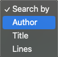
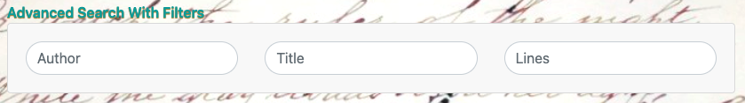
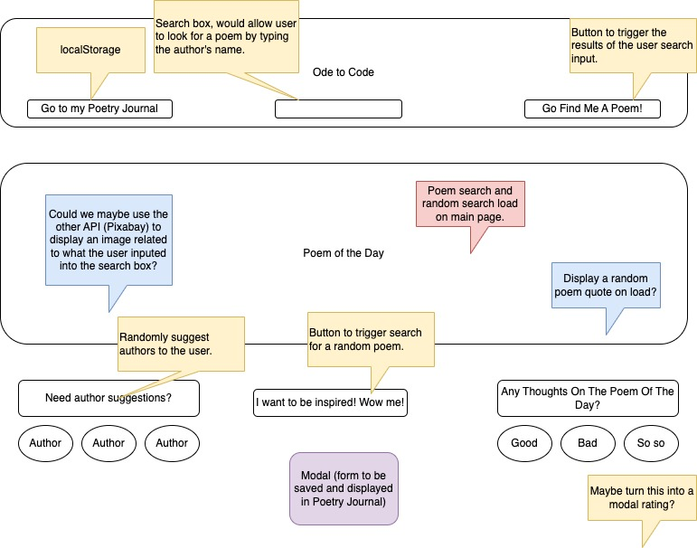
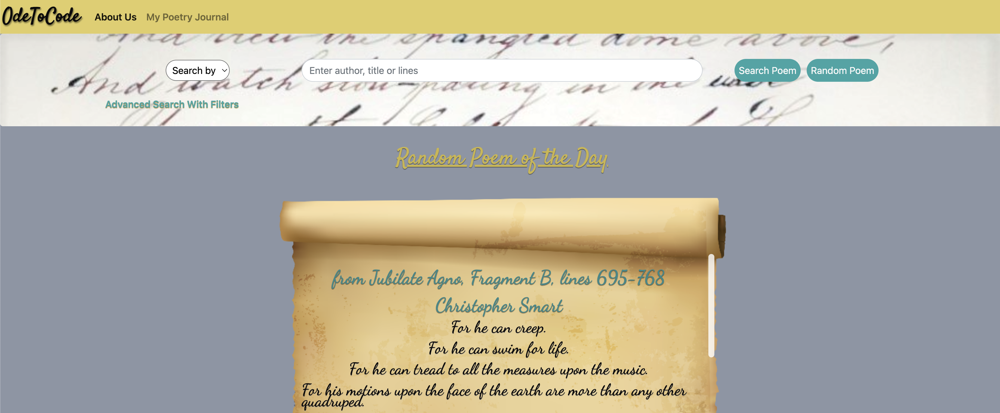

# 

## **General Description**

This is the first group project of the Trilogy Skills Bootcamp in Front-End Web Development.

We were tasked with building a web application from scratch, for which we needed to rely on both technical and soft skills:

- We had to come up with and execute a design of our own making.
- We had to integrate data received from server-side API requests.
- We had to make use of many of the topics learned in the last few months:
  - HTML
  - CSS
  - Bootstrap
  - JavaScript
  - jQuery
  - Ajax
- We had to work collaboratively, relying on Agile development methodologies.

## **What is OdeToCode?**

An homage to poetry and technology, OdeToCode allows a user to run multiple types of searches on the topic of poetry and save their thoughts on their preferred poems on a Poetry Journal.

OdeToCode accepts and reacts to user input, by way of searches the user can run. Multiple search options are available, as outlined below:

The user can elect to search by one single parameter:

The user can perform a more advanced search by using two text parameters:

Should the user wish to be surprised, there is also the option to fetch a random poem, and the author suggestions in the page are also randomized, which ensures a constant feed of novel poetry.

Furthermore, the user can also use the "Reflections" button to save their thoughts on a particular poem, which the user can then revisit by accessing the Poetry Journal section of OdeToCode.

## **PoetryDB API**

To achieve the goals above, we made use of the [PoetryDB](https://poetrydb.org/index.html) API.

Via this API we where able to use the following routes to obtain the information our web application currently displays, which we divided into search and advanced search with filters:

**Search**

- Display poem by an author specified by the user
  - https://poetrydb.org/author,random/author;1
- Display poem by a title specified by the user
  - https://poetrydb.org/title,random/title;1
- Display poem by words/lines specified by the user
  - https://poetrydb.org/lines,random/lines;1
- Fetch a completely random poem
  - https://poetrydb.org/random;

**Advanced Search (user can select up to two combined search parameters)**

- Display poem based on author + title input
  - https://poetrydb.org/author,title,poemcount/author;title;1
- Display poem based on author + lines input
  - https://poetrydb.org/author,lines,poemcount/author;lines;1;
- Display poem based on title + lines input
  - https://poetrydb.org/title,lines,poemcount/title;lines;1;

We have also implemented modals that alert the user in case their input is missing and/or nothing can be found for what they are searching for.

## **Our Approach**

We decided to took an incremental approach to our project:

- We first agreed on what we would like to work on, and discussed APIs we were interested in experimenting with.
- We then created a wireframe of what our plan would look like visually, with a few notes on how some of the visual elements would be expected to work, from a functional perspective.
- We then came up with user cases that would fit our wireframe.
- We split our tasks into areas of concern, and these were placed in a GitHub Kanban Project Board.
- We decided to take a few rounds practicing the Git flow of creating branches locally, pushing them up to GitHub, opening pull requests and merging.
- We also took some time tinkering with the APIs of our choice, to ensure they were fit for purpose and would allow us to achieve our goals.

## **Our MVP**

As for our MVP it can be illustrated by our initial wireframe:

The main goal was to have 2 requests from the API displaying on the main page:

- A user based poem search
- A random poem

For comparison with our planned MVP, this is what our project currently looks like:

Other than the functionality we had planned, great care was take to ensure that style wise, the project also matches the theme, so that the user experience in OdeToCode is a pleasant one.

## **Further Functionality**

We feel like we achieved most of what we set out to do in our MVP.

As for further plans, we would eventually like to integrate a second API - [Pixabay](https://pixabay.com/api/docs/) - so that images relating to the author, poem, or the theme of poetry are displayed behind the main poem card.

## **What have we learned from this experience?**

As with all projects, this one was not without its challenges.

We did run into a few issues with merge conflicts but managed to resolve them.

Working in a group is very different than working solo and we feel we did a good job at identifying each person's strong suits and applying them to different areas of the project.

We spent quite a bit of time planning our approach, which we feel benefited us in the end, as it made it easier to keep us on track and gave us a clear view of what we wanted to achieve from the get go.

<!-- ## **Project Presentation**
 -->

## **Contributors**

- [Dev-Shai](https://github.com/Dev-Shai)
- [marinaongithub](https://github.com/marinaongithub)
- [SucaadGetHub](https://github.com/SucaadGetHub)
- [vcdsc](https://github.com/vcdsc)

## **GitHub Pages**

Deployed version of this project can be seen [here](https://marinabtc.github.io/OdeToCode/index.html).

## **License**

Please refer to the LICENSE in the repo.
